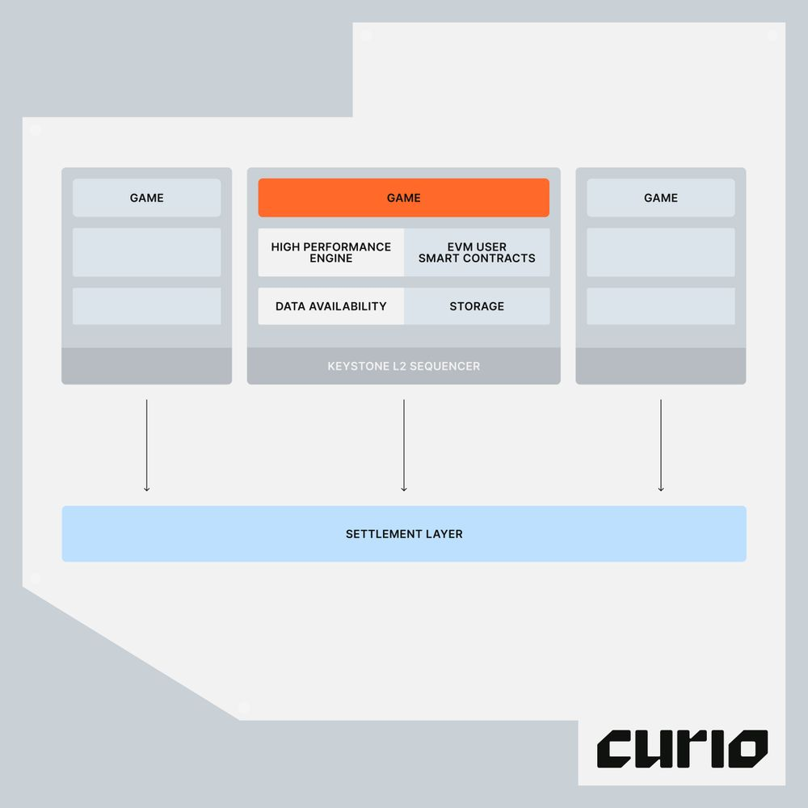

Keystone is an excellent toolkit designed by the Curio team based on many years of experience in blockchain game development. It is the best toolkit for building high performance and composable onchain games.

Keystone 是 Curio 团队基于多年的链上游戏开发经验而精心设计的，是构建高性能和可组合链上游戏的最佳工具包。

The Keystone framework is founded on a "high tick rate" game engine that specifically caters to powering real-time strategy games, e.g. titles like Age of Empires It will support various data availability (DA) layers, starting with Celestia.

Keystone 框架建立在一个“高刷新率”游戏引擎之上，专门适用于实时策略游戏，例如帝国时代等游戏。它将支持各种数据可用性（DA）层，首先是 Celestia。

:::tip

**`Data Availability`**: Prove data was published to the network

**`数据可用性`**：证明数据已发布到网络

Celestia is a data availability (DA) layer that provides a scalable solution to the [**`data availability problem`**](https://coinmarketcap.com/academy/article/what-is-data-availability). Due to the permissionless nature of the blockchain networks, a DA layer must provide a mechanism for the execution and settlement layers to check in a trust-minimized way whether transaction data is indeed available.

Celestia 是一个数据可用性（DA）层，为[**`数据可用性问题`**](https://coinmarketcap.com/academy/article/what-is-data-availability)提供了一种可扩展的解决方案。由于区块链网络的无需许可特性，DA 层必须提供一种机制，使执行层和结算层能以一种信任最小化的方式检查交易数据是否确实可用。

:::

## Inside Keystone 深入理解 Keystone

**Keystone represents a step-function improvement in how onchain games are built. Think of Keystone as a blockchain and a game server enshrined in one unit. It’s designed from grounds up to create a highly performant data oriented game server with the composability of EVM smart contracts.**

**Keystone 是一个全链游戏的创新平台。它把区块链和游戏服务器结合在一起，从零开始打造了一个高性能、数据驱动的游戏服务器，同时兼容 EVM 智能合约。**

### 1. State management 状态管理

Keystone uses a table-based state management system inspired by ECS. Each entity is associated with a schema struct with full type support in Go. Clients, whether in JavaScript or Unity, can subscribe to automatically sync state with no additional code. We’ve also entirely eliminated the need for an indexer, reducing latency dramatically. Query and subscribe to data streams directly from Keystone.

Keystone 采用了 ECS 的思想，建立了一个表格化的状态管理系统（table-based state management system）。每个实体都对应一个完整类型支持的 Go 模式结构。客户端，无论是 JavaScript 还是 Unity，都可以订阅状态的自动同步，无需多余的代码。我们还消除了对索引器的依赖，大幅降低了延迟。可以直接从 Keystone 查询和订阅数据流。

### 2. Execution 执行

Game logic, organized into systems, is written in Go instead of Solidity, allowing developers to fully leverage existing libraries and 3rd party services while increasing performance drastically. The heartbeat of Keystone is a fast-paced game tick. At each tick, transactions submitted from the last tick are processed via systems. Transactions are executed atomically just like smart contracts, and Keystone can comfortably process tens of thousands of transactions per second with hundreds of ticks per second.

游戏逻辑，也就是 ESC 中的系统，使用 Go 编写，而不是 Solidity，这让开发者可以充分利用现有的库和第三方服务，同时显著提高性能。Keystone 的核心是一个快速的游戏 tick。在每个 tick 中，系统会处理上一个 tick 提交的交易。交易像智能合约一样原子地执行，Keystone 可以每秒轻松处理数万笔交易，每秒数百次 tick。

In addition, Keystone supports transaction replay — by deterministically playing back user transactions, developers can instantly rewind the game state back to any point in time — a handy tool for debugging, collecting analytics, and more.

此外，Keystone 还支持交易回放 - 通过确定性地回放用户交易，开发者可以随时将游戏状态回退到任何时间点 - 这是一个方便的用于调试、分析等工作的工具。

### 3. Plugins 插件

Keystone supports a wide range of plugins for persistent data storage, data availability, and more. We offer out of the box support for SQLite and MySQL solutions for backing up data when game worlds need to be consistent, making it easy to create data pipelines, analytics and logging services. Developers can create custom plugins by following a standard interface.

Keystone 支持多种插件，用于数据存储、数据可用性等。我们为 SQLite 和 MySQL 解决方案提供了现成的支持，可以在游戏世界需要保持一致的时候备份数据，方便创建数据管道、分析和日志记录服务。开发者也可以按照标准接口创建自定义插件。

### 4. EVM

The Keystone EVM and game server is enshrined in a single instance. To do this, we’ve taken the necessary components from Geth and integrated it with the rest of the Keystone server, making the EVM hyper performant and specifically tailored for games. Smart contracts deployed on Keystone can both read and write data from the table-based state through precompiles. We will release more updates on the Keystone EVM soon.

Keystone EVM 和游戏服务器封装在一个实例中。为此，我们从 Geth 中提取了必要的组件并将其与 Keystone 服务器的其他部分集成在一起，使 EVM 具有超高性能，并专门针对游戏进行了定制。部署在 Keystone 上的智能合约可以通过预编译程序从表格化的表中读取和写入数据。我们将很快发布有关 Keystone EVM 的更多更新。

The synthesis between a traditional game server architecture and the battle-tested EVM gives developers a highly performant system while retaining the full composability of smart contracts. We couldn’t be more excited to share this with the world.

Keystone 将传统的游戏服务器架构和经过验证的 EVM 融合在一起，为开发者提供了一个高性能的系统，同时保留了智能合约的完整可组合性。我们非常高兴能够与世界分享这一点。

> ## Reference 参考资料
>
> [Introducing Keystone](https://blog.curio.gg/introducing-keystone/)
>
> [Curio：介绍全链游戏引擎 Keystone](https://mp.weixin.qq.com/s/olFMYpU_Hsn-z6FARU2qYw)
